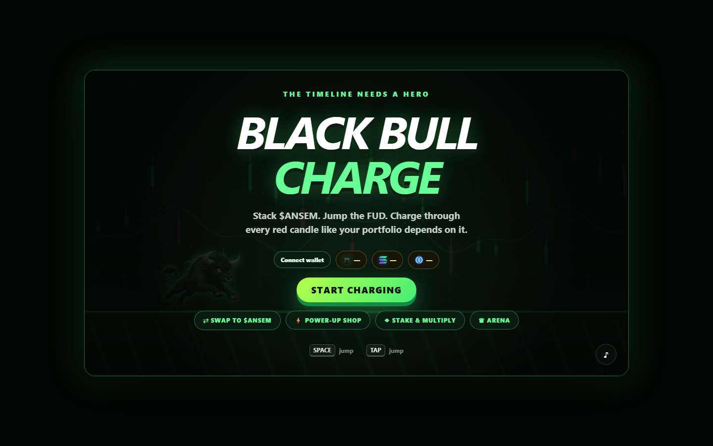

<div align="center">

# 🐂 $ANSEM Black Bull Charge

### Charge forward. Jump the FUD. Fuel the bull with real Solana utility.

[](https://theblackbullcharge.vercel.app)
[](https://solana.com)
[](#technology)

**[Play the game](https://theblackbullcharge.vercel.app)** ·
**[View $ANSEM on Solscan](https://solscan.io/token/9cRCn9rGT8V2imeM2BaKs13yhMEais3ruM3rPvTGpump)**

</div>



## What is Black Bull Charge?

Black Bull Charge is a premium, browser-based endless runner built for the
$ANSEM community. Run as the Black Bull, collect $ANSEM coins, clear bears,
FUD signs, rugs and red candles, then use real Solana features without leaving
the game.

The complete playable application—including the animated bull sprite and
official token assets—is embedded in a single `index.html` file.

## Highlights

- 🐂 Animated Black Bull endless-runner gameplay
- 📱 Keyboard, mouse and mobile touch controls
- 👻 Phantom, Solflare and Backpack wallet support
- 💰 Live SOL, USDC and $ANSEM balances
- 🔄 Bidirectional Jupiter swaps:
  - Native SOL / USDC → $ANSEM
  - $ANSEM → native SOL / USDC
- ⚡ Real $ANSEM-powered boosts
- 🔥 Atomic 70% treasury / 30% burn purchase split
- 💎 Signed-message staking multiplier MVP
- 🏆 Daily, weekly and all-time local leaderboards
- 🎯 Run quests and tournament-ready UI
- 🔊 Generated jump, collect and game-over sounds
- ✨ Particles, screen shake, crypto candles and responsive presentation

## How to play

| Action | Desktop | Mobile |
|---|---|---|
| Jump | `Space`, `↑` or `W` | Tap the game |
| Start / retry | Button or `Space` | Tap the button |
| Pause and shop | **Shop / Pause** | **Shop / Pause** |
| Mute | `♪` button | `♪` button |

Your score combines distance, collected coins and any active staking
multiplier. The game accelerates over time, so late-run jumps need sharper
timing.

### Obstacles

- **Bears** — compact ground blockers
- **FUD signs** — tall obstacles that demand a full jump
- **Red candles** — painful market reminders
- **Rugs** — low-profile traps with forgiving collision boxes

## Power-up shop

Power-ups activate only after the signed SPL transaction is confirmed on
Solana.

| Power-up | Price | Effect |
|---|---:|---|
| Mega Charge | 10 $ANSEM | 35% speed burst for 7 seconds |
| Moon Jump | 25 $ANSEM | Higher jumps for 45 seconds |
| Diamond Shield | 50 $ANSEM | Invincibility for 8 seconds |
| Full Send Revive | 100 $ANSEM | Automatically survives one collision |

Every purchase is one atomic transaction:

- **70%** → community treasury for prizes, events and development
- **30%** → permanently burned

## Solana configuration

| Purpose | Address |
|---|---|
| $ANSEM mint | [`9cRC...pump`](https://solscan.io/token/9cRCn9rGT8V2imeM2BaKs13yhMEais3ruM3rPvTGpump) |
| USDC mint | [`EPjF...Dt1v`](https://solscan.io/token/EPjFWdd5AufqSSqeM2qN1xzybapC8G4wEGGkZwyTDt1v) |
| Community treasury | [`CuVu...SuLB`](https://solscan.io/account/CuVuDcp1iBRggUT3D1ktxFDhZSgJn6ZbfwkfytfsSuLB) |

The $ANSEM mint is Token-2022 with six decimals. Token balances are read from
canonical associated token accounts. Swaps use Jupiter's current Lite Metis
API, with native SOL wrapping and unwrapping handled inside the swap
transaction.

## Staking multiplier MVP

The current staking flow is intentionally non-custodial:

1. The player chooses a pledge amount.
2. The wallet signs a human-readable message.
3. The signature is verified locally.
4. The multiplier is stored for that wallet in local storage.

No tokens are locked or transferred by this MVP staking flow. A production
version should replace it with an audited Anchor staking program.

## Technology

- HTML5 Canvas
- Vanilla HTML, CSS and JavaScript
- `@solana/web3.js`
- `@solana/spl-token`
- `tweetnacl`
- Jupiter Swap API
- Token-2022
- Vercel static hosting

No framework, build process or application server is required.

## Run locally

```powershell
git clone https://github.com/Datwebguy/theblackbullcharge.git
cd theblackbullcharge
python -m http.server 8000
```

Open [http://localhost:8000](http://localhost:8000).

Wallet extensions treat `localhost` as a secure development context. Avoid
opening `index.html` directly when testing wallet or network functionality.

## Deploy

The repository is connected to Vercel. Pushes to `main` automatically produce
new deployments.

Manual deployment:

```powershell
vercel --prod
```

## Project structure

```text
.
├── index.html                  # Complete game and Solana integration
├── docs/
│   └── black-bull-charge.png  # Repository preview
├── README.md
└── .vercelignore
```

## Security and production notes

- Wallet private keys never enter the application.
- Purchases and swaps require explicit wallet approval.
- Boosts activate only after confirmed transactions.
- Swap responses validate input mint, output mint, amount, payer and signer
  layout before requesting a signature.
- Expired swap signatures are checked against transaction history before a
  retry is offered.
- The shared public RPC should be replaced with a dedicated production RPC.
- Global leaderboards, tournaments and rewards require server-side replay and
  score validation before real payouts are enabled.
- Treasury and mint addresses should be independently verified for every
  production release.

## Roadmap

- [ ] Deterministic server-side run validation
- [ ] Global leaderboard API
- [ ] Audited Anchor staking vault
- [ ] Treasury-backed daily and weekly reward claims
- [ ] On-chain tournament entry and prize pools
- [ ] Referral tracking
- [ ] More obstacles, maps and seasonal events

## Asset provenance

- Solana mark: [official Solana brand assets](https://solana.com/branding)
- $ANSEM mark: verified Black Bull project image for the configured mint
- USDC mark: verified Solana token-list asset
- Wallet marks: official Phantom, Solflare and Backpack website assets
- Bull runner: project-specific four-frame illustrated sprite sheet

## Disclaimer

This project is an experimental community game, not financial advice. Review
all wallet prompts and transaction details before signing. Mainnet tokens and
SOL have real value.

---

<div align="center">

**Charge forward with $ANSEM power.**

</div>
